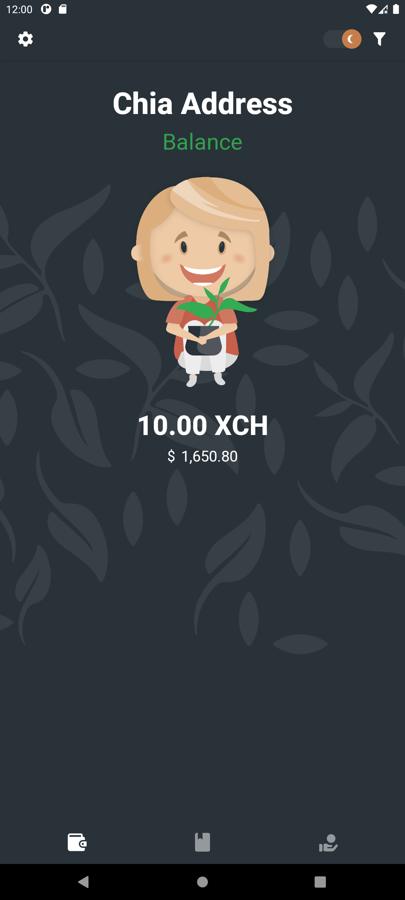

# Chia-Address-Balance

A React Native application which works both on Android and Apple, to show ones Chia wallet balance. It requires no private data at all. It just uses the data from https://www.chiaexplorer.com/ which is public to everyone.

It's still very much in beta, still requires more testing.
I do plan to add more features. But nothing which needs any private data.

## Screenshots

<p>
      
      
      
       
</p>

## Donate

If you enjoy using the app feel free to leave a small donation

@BubbleTrouble14 wallet addresses:
```
XCH: xch1ek6342kyg8lsxlr4mntwanmc9qa44h9tp5vndg36a6jak4xwlezqxjwapl
DOGE: DRdkStn4bQtXUzk5s6K8JGs6REU3U7LwwJ
ETH: 0x3C727882637972Ca6dbC13F287A98e8C6d60Bb10
ADA: addr1q80lu5nmd7hngkpvhzjpl8fqgn7t3lyf9rdzg6gy7umqw4wllef8kma0x3vzew9yr7wjq38uhr7gj2x6y35sfaekqa2sw6xgwr
USDT (ERC20/BEP20): 0x3C727882637972Ca6dbC13F287A98e8C6d60Bb10
BNB: bnb1sr3gp054v62lr85np92ydsac7qz8jszkgfzc9n
BTC: bc1qpml3gzu6hwfqjlwmjsaqwlnnepxmtjpsw2xnne
BCH: qq4q8mz96vqcep8yfrw3y93p0605uxs8tqg0ypwr6w
```

## Acknowledgements
Icons by Google and [Material Design Icons](https://materialdesignicons.com/)

This project is not affiliated with [Chia Network™](https://www.chia.net/).
